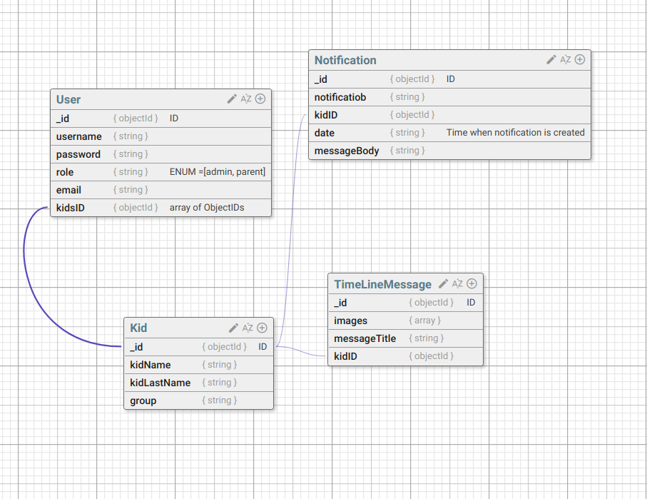
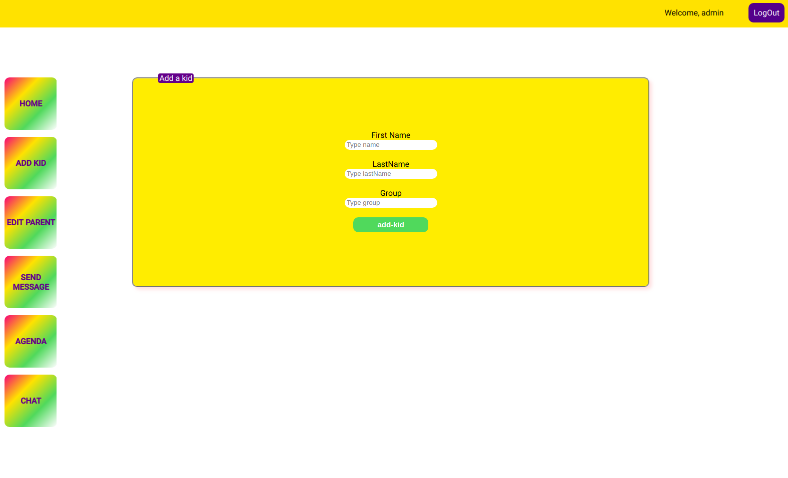

# HappyKid

Project has three parts:

- Authentication part
- Main part (for parents)
- Admin part (for teachers)
- GlobalSwitch component (which makes main role in routing inside application, nested routes).

## Instructions
.env file - backend
PORT=5000
ENV=development
S3_KEY=AWS S3
S3_SECRET=AWS S3
S3_BUCKET=AWS S3
instanceLocator= ChatKit
key= ChatKit
mongoDB = Atlas Cluster

.env file - client
REACT_APP_instanceLocator=ChatKit
REACT_APP_tokenURL=ChatKit
key=ChatKit

### Functionalities
- InfiniteScroll in TimeLineMessagesKid (React Component)
- Visual date selection in Calendar (React Component)
- Chat application (ChatKit APIs)
- GoogeMaps in FindUs (React Component)

### Tools
- Node.js
- Express.js
- React.js
- MongoDB
- Moment.js
- GoogleMaps
- ReactComponents: Gallery, InfiniteScroll

### Preview
### database schema

#### authentication

#### parents

#### teachers

